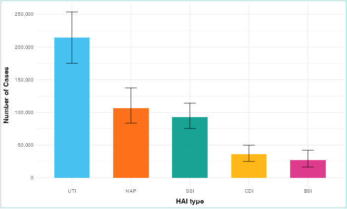
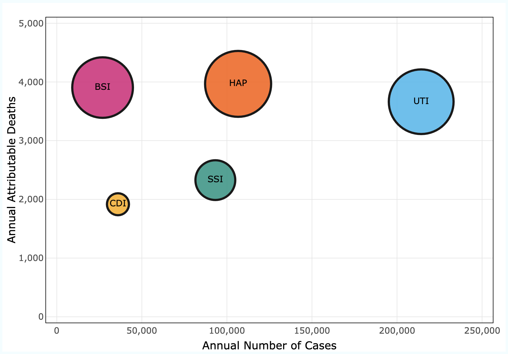
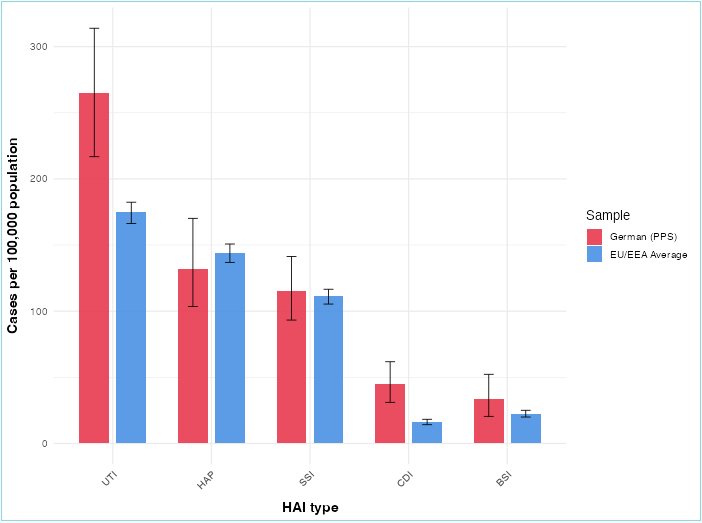

```{r, include = FALSE}
knitr::opts_chunk$set(
  collapse = TRUE,
  comment = "#>"
)
```

```{r load_pkg, include=FALSE}
library(hihai)
```

## Introduction

Imagine going to the hospital for treatment but end up leaving with another infection.

Healthcare-associated infections (HAIs) are a major health burden in Germany, affecting approximately **1 in 25** hospitalised patients. These infections cause significant **illness, deaths, and health costs** every year.

The `hihai` package provides clean datasets and interactive Shiny app to explore, visualise, and interpret the burden of HAIs in Germany using the data from **2011 ECDC Point Prevalence Survey**.

### What you'll learn
By the end of this guide, you'll be able to:

1. Load and explore HAI datasets
2. Understand key metrics
3. Use the interactive Shiny app to analyse HAIs
4. Compare Germany's burden with EU/EEA countries
5. Analyse which infections cause the most harm
6. Further suggest any recommendation that tackle problems

---

## About the data

The package uses two cleaned datasets:

1. `hai_data`: German PPS (46 German hospitals with 9,626 patients) with 95% uncertainty interval (UI).

2. `hai_comparison`: Germany vs EU/EEA rates using ECDC PPS (1,149 hospitals with 273,753 patients) with 95% uncertainty interval (UI).

## What's measured

- **hai_type:** abbreviation of 5 HAI types
- **hai_name:** name of 5 HAI types
- **cases:** Annual number of infections
- **deaths:** Attributable mortality
- **dalys:** Disability-adjusted life years (YLL + YLD)
- **yll:** Years of life lost
- **yld:** Years lived with disability

*All estimates include lower and upper bound for 95% UI*

**Exploring Germany's HAI burden:**
```{r}
head(hai_data)
```

**For international comparison:**
```{r}
show(hai_comparison)
```

---

## Install & Run

Install `hihai` from Github:
```{r install-pack, eval=FALSE}
# install.packages("remotes")
remotes::install_github("ETC5523-2025/assignment-4-packages-and-shiny-apps-arisarath")
```

Load the package:
```{r load, eval=FALSE}
library(hihai)
```

This application contains 3 main tabs; explore, severity, and comparison.

- Explore view: Examine HAI frequency with customisable metrics
- Severity view: Visualise the relationship between frequency and impact
- Comparison view: Contrast German rates with EU/EEA averages

Launch the Shiny app:
```{r launch-app, eval=FALSE}
launch_app()
```


---

## Tab1: Explore - Understanding frequency

**Question answered:** How common each HAI type is and what impact do they have?

### What you see
This tab focuses solely on Germany (German PPS data).

The **Bar chart** shows the frequency of HAIs in selected metric (cases, deaths, or DALYs) for each HAI type in descending order.

### Interactive controls
1. Metric dropdown: 
  - Cases: How many infections occurred
  - Deaths: How many people died from HAIs
  - DALYS: Overall health burden
  - YLLs: Years of life lost
  - YLDs: Years lived with disability

2. Check box
  - Check/uncheck to filter specific infections
  - Useful for comparing side-by-side data

3. 95% UI toggle
  - Shows error bars for statistical uncertainty
  - Lower and upper bound where the true value likely falls

### How to read the chart

```{r}
#| echo: false
#| out.width: "80%"
#| fig.align: "center"
#| fig.cap: "Figure1. Bar chart illustrate frequency of HAIs"


```

- **X-axis:** HAI types (UTI, HAP, SSI, CDI, BSI)
- **Y-axis:** Changes based on your selected metric
- **Bar height:** Value for that metric
- **Error bars:** 95% Uncertainty interval
- **Colors:** Each HAI type has a distinct color

### Data table
Table shows the actual number of cases, deaths, DALYs, YLLs, and YLDs.

You can sort by clicking column headers (Descending or Ascending).

### Key findings
At the bottom, the app automatically generates a **ranking summary**.

*Example: When we look at cases: total = 476,936 cases. *
*1st rank is Urinary Tract Infection (UTI) with 214,150 cases, accounting for 44.9% of total infections.*

This summary updates based on your selected metric, making it easy to capture findings. 

**What you learn:** UTI is the most common type of HAI, but HAP causes the most harm overall.

---

## Tab2: Severity - Visualising the impact

**Question answered:** Which infections are most deadly relative to how common they are?

Frequency alone doesn't tell the full story. To understand impact, the package combine cases, deaths, and DALYs using a bubble chart. 

### What you see

The **Bubble chart** reveals the relationship between:

- Frequency (how common)
- Mortality (how deadly)
- Burden (overall impact)

### How to read the bubble chart

```{r}
#| echo: false
#| out.width: "80%"
#| fig.align: "center"
#| fig.cap: "Figure2. Bubble chart demonstrate severity of HAIs"


```

- **X-axis:** Annual number of cases (Further right => more common)
- **Y-axis:** Annual attributable deaths (Higher => more deadly)
- **Bubble size:** DALYs (bigger bubble = higher overall burden)
- **Color:** Each HAI type has a distinct color
- **Label:** Abbreviation of HAI type (UTI, HAP, SSI, CDI, BSI)

### Interactive features
**Hover over any bubble** to see a detailed statistics:

*Example tooltip:* 
```
Urinary Tract Infection
Cases:214,150 (175,086 - 253,524)
Deaths: 3,664 (1,462 - 7,533)
DALYs: 66,701 (27,890 - 128,543)
```

### Interpreting the chart

**Upper Right (e.g., UTI)**

- Many cases (far right)
- Moderate deaths (middle height)
- Large bubble (high total burden due to volume)

**Upper left (e.g., BSI HAP)**

- Fewer cases (left side)
- High deaths (high up)
- Large bubble (high burden despite lower frequency)

### Key findings
Frequency alone is misleading, BSI has only 26,976 cases but 3,905 deaths while UTI has 214,150 cases but 3,664 deaths.

**What you learn:** Despite having fewer cases, BSI causes similar total deaths.

---

## Tab3: Comparison - Germany VS EU/EEA

**Question answered:** How Germany's HAI burden perform comparing to other European countries?

### What you see
A **side-by-side bar chart** comparing:

- Red bars: Germany (German PPS)
- Blue bars: EU/EEA Average (ECDC PPS)

### Interactive controls
1. Metric dropdown:
  - Cases: How many infections occurred
  - Deaths: How many people died from HAIs
  - DALYS: Overall health burden

2. Population scale slider:
  - Adjust from 1,000 to 100,000
  - Changes the "per X population" calculation
  - Default: 100,000 population

### How to read the chart

```{r}
#| echo: false
#| out.width: "80%"
#| fig.align: "center"
#| fig.cap: "Figure3. Clustered bar chart compare Germany with other European countries"


```

  - **X-axis:** HAI types (UTI, HAP, SSI, CDI, BSI)
  - **Y-axis:** Rates per 100,000 population (adjust according to slider)
  - **Error bars:** 95% Uncertainty interval

### Key findings
Below the chart, the app automatically generates an **automatic interpretation** that compares each HAI type based on metric you choose.

```
Example: When we look at (100,000 population), 
Comparing German PPS to EU/EEA rates for DALYs:
- CDI: Germany 159% higher (25.9 vs 10)
- UTI: Germany 45% higher (82.6 vs 57.1)
- HAP: Germany 22% lower (86.1 vs 109.8)
- BSI: similar rates (Germany: 72.2 vs EU/EEA: 76.2)
- SSI: similar rates (Germany: 35.7 vs EU/EEA: 35.1)*
```

**What you learn:** Germany shows higher burden across most of the metrics, despite having good hospital infection protocol. Reasons include high hospitalisation rates and large bed capacity, which create more exposure opportunities.

---

## FAQ & Common Questions
### Q1: Why sometimes the number is not exactly match?
**Ans:** All row is calculated independently using Monte Carlo simulations. Due to rounding in UI, it may result in differ from sum of individual HAI types.

### Q2: What does 95% UI means?
**Ans:** It is an uncertainty interval where confidently 95% true value lies within this range.

### Q3: Which metric should I use?
**Ans:** 

| Question                           | Use   |
|------------------------------------|--------|
| "How common is this?"              | Cases |
| "How deadly is this?"              | Deaths |
| "What's the overall burden?"       | DALYs |
| "How many years of life are lost?" | YLLs  |
| "How much disability does this cause?" | YLDs |

---

## Summary: key takeaways
### 1. The problem is significant
HAI are major health burden in Germany that causes more than **478,000 cases**, over **16,000 deaths** and **249,000 DALYs** each year.

### 2. Frequency VS Severity
**UTI** is the most common type of HAI contributing to **45% of total cases** but causes **moderate severity** to human. Meanwhile **HAP and BSI** are less common with roughly **22% and 6% of overall frequency** but causes **51% of total mortality**.

### 3. Germany VS Europe
Germany has a **higher population burden** than EU/EEA average. Due to high hospitalisation rates and bed capacity accelerate exposure overall.

### 4. Suggestions
According to WHO, 20-30% of HAIs are preventable through better hygiene, infection control, and shorter hospital stays. Prevention strategies should prioritise infections that cause the greatest harm, not just the most frequent one.

---

## Learn more

### Access package data
```{r help, eval=FALSE}
# Load datasets
data("hai_data")
data("hai_comparison")

# View documentation
?hai_data
?hai_comparison
?launch_app
?hihai #For package help
```

## Acknowledgements and Licensing

This package and interactive Shiny application were developed as part of the ETC5523 assignment.

Package development, documentation, and pkgdown site creation were supported by R ecosystem: 

- `usethis`, `devtools`, `roxygen2` for package setup and documentation
- `pkgdown` for website structure and deployment

The Shiny application uses:

- `shiny` and `shinythemes` for UI layout and CSS custom styling
- `ggplot2` for visualisations
- `plotly` for interactive plots
- `DT` for interactive data tables
- `dplyr` and `tidyr` for data wrangling
- `scales` for number formatting

**LICENSING**
This package is released under the MIT License.
You are free to reuse or modify the code in this package under the terms of the LICENSE file included in the repository. Data is provided for non-commercial and educational use. The original data sources remain the property of the European Centre for Disease Prevention and Control (ECDC).

The underlying data originates from **2011 ECDC Point Prevalence Survey (European Centre for Disease Prevention and Control** and is based on the BHAI approach from [Zacher et al. (2019)](https://doi.org/10.2807/1560-7917.ES.2019.24.46.1900135)

All visualisation, transformation, and interpretation in this package is written by the author.

## Original study

Zacher, B., Haller, S., Willrich, N., Walter, J., Sin, M. A., Cassini, A., Plachouras, D., Suetens, C., Behnke, M., Gastmeier, P., Wieler, L. H., & Eckmanns, T. (2019). Application of a new methodology and R package reveals a high burden of healthcare-associated infections (HAI) in Germany compared to the average in the European Union/European Economic Area, 2011 to 2012. Eurosurveillance, 24(46).
https://doi.org/10.2807/1560-7917.es.2019.24.46.1900135
